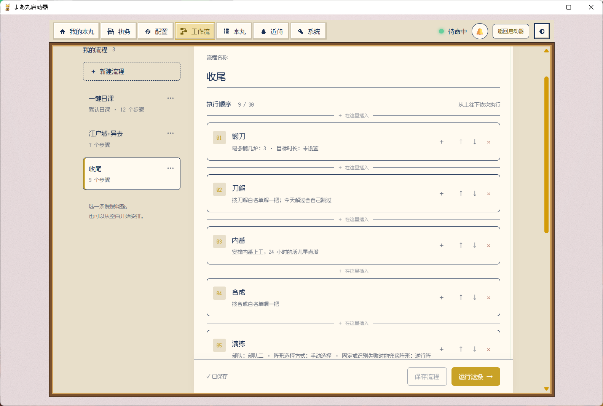
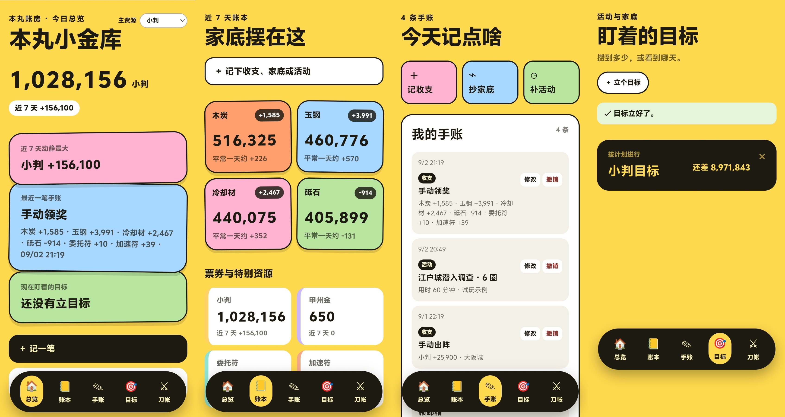

# まあ丸 `🦊` — 《刀剑乱舞 ONLINE》国服本丸管家

**简体中文** · [English](README_EN.md)

[](LICENSE)
[](pyproject.toml)
[](https://github.com/DbDB68/maamaru-engine)

> **你决定今天的本丸要做什么，剩下的执行、照看、收尾和记账交给まあ丸。**

我玩刀剑乱舞九年了，现在还是想玩，只是不想再亲自点完每一轮重复操作，也不想继续手拉 Excel 才知道资源从哪来、花到哪去。所以我做了まあ丸：需要时替我照看本丸，不连接游戏时也能安静地做一间账房。

**[下载最新版](https://github.com/DbDB68/maamaru-engine/releases/latest)** · **[使用说明](docs/user-manual.md)** · [v0.6.1 更新内容](docs/releases/v0.6.1.md) · [提交问题](https://github.com/DbDB68/maamaru-engine/issues)

## 欢迎回到我的本丸


给审神者留一处自己的空间：头像、近侍刀、随手写的小记，执务留下的记录，还有惦记着的刀剑和目标。庭院里，小狐丸和狐之助偶尔串门聊两句；今天的本丸，也慢慢攒成了自己的日常。和纸与像素两套主题，随时一键换装。

开工之前，先回来坐一会儿。

## 打开以后，选一条路

| 今天想做什么 | 从哪里进去 | 最后得到什么 |
|---|---|---|
| 跑日课、远征、出阵或活动 | **启动まあ丸** | 它负责重复操作、现场照看和异常恢复，收工后留下成绩单 |
| 盘家底、补手账、算活动目标 | **只打开账房** | 完全不连接游戏，直接使用电脑里的成绩单、规划、手账和 Excel |
| 随手记资源、目标和刀剑等级 | **Android 离线账房** | 一只独立的黄色小账房，数据只保存在手机里 |

前两个入口共用同一份电脑账本；Android 版目前不联网，也不与电脑同步。

## 一次正常的本丸工作流

**选任务 → 定部队、停止条件和资源许可 → 开工。**

运行时，日志会持续说明まあ丸正在做什么；重伤、手形不足、识别失败或网络超时都有明确的停下与恢复规则。审神者不需要盯着每一次点击，只需要保留对目标、阵容和风险的决定权。

想自己安排今天干什么，就用**自定义工作流**：日课、远征、出阵、活动都是积木，按喜欢的顺序垒起来，起名保存、钉到首页，跑完还能安排它退出游戏、关模拟器或让电脑休眠——睡前挂一条，まあ丸收完工自己下班。




收工后先看到的是“这次做成了什么、最近发生了什么”，需要追账时才继续展开日期、任务和资源来源。能够确认的变化才归因，无法确认的仍然写作未知。

顶栏铃铛是异常与通知中心：脚本崩溃、看门狗强制结束或一键日课没有全绿时，会直接说明发生了什么、可能原因和现在该做什么；同一种问题复发只累计次数，不反复刷屏。

## 活动怎么刷，先算再决定


活动开了不用拍脑袋刷：选定地图和每天能留的时间，まあ丸按实测圈速估出预计能打多少圈、要备多少小判、大约花几小时，可以一键立为独立活动预算，不跟日常开销混账。门票消耗、宝物碎片掉率、里程碑奖励和本期加倍时间都在同一张卡上；每圈结束还会读取碎片库存做差分记账，自家掉率数据越刷越准。

## 不想连游戏，就只开账房


“只打开账房”不会启动模拟器、ADB、MAA、远征排班或游戏脚本。可以手动记收支、当前家底和自己打的活动，查看趋势与异常日，建立资源或活动目标，再让狐之助按近期速度估算什么时候能完成。

Excel 可以带走完整流水、当前家底和每日汇总，也可以把旧账带回来。导入前先预览，遇到冲突必须确认，真正写入前自动备份；まあ丸已经确认的流水只能导出，旧表不能反向改写它。



Android APK 是这间账房的离线试玩版：可以记资源、家底、活动、目标，以及刀剑男士等级、乱舞等级和备注。它不含游戏操作，也没有联网权限。

## 审神者和まあ丸各管什么

| 审神者决定 | まあ丸接手 |
|---|---|
| 今天的目标、部队与阵形规则 | 按约定执行重复步骤 |
| 轻伤／中伤／重伤时何时停止 | 识别伤势，阻止危险出阵 |
| 是否补手形、用小判或消耗道具 | 在许可范围内操作，条件不明时停下 |
| 哪些刀允许手入、刀解、合成或活动使用 | 按名单保护，不擅自扩大范围 |
| 哪些资源变化是自己做的 | 保存机器记录与手动说明，不把猜测写成事实 |

## 现在能替本丸做什么

- **日课与远征**：登录、签到、万屋、演练、远征、内番、锻刀、刀解、合成、任务奖励、收件箱和库存快照可以自由组合成一键日课，或用自定义工作流拼成任意顺序的流水线，跑完自动收尾。
- **出阵与活动**：普通合战场、异去第一章、大阪城、江户城 E4、联队战与南瓜大作战；各玩法保留自己的圈数、阵容、伤势和消耗含义。
- **安全照看**：重伤拦截、伤势停止、手入续跑、补刀装、自动换队长、中断恢复、看门狗和明确的结束动作。
- **成绩单**：汇总出阵、活动、锻刀、掉落、资源变化与异常日；心愿刀入手时额外提醒，没认出名字时不冒充成功。
- **玩法规划**：异去圈数、工时与小判预算按实测圈速自动试算；资源目标附「去哪弄」获取途径；锻刀短板与博多小判消耗有专卡监督。
- **本丸账房**：手动收支、家底、活动、目标、历史记录、Excel／CSV 导入导出与备份；机器任务和玩家手动记录分开计数。
- **出错会说人话**：事故单给出结论、可能原因、下一步和对应任务入口；任务没有真正完成时，成绩单不会假装全绿。

每个任务的具体选项、开工准备和停止条件都放在 [まあ丸使用说明](docs/user-manual.md)，README 不再重复一遍菜单。

## 下载与开始

从 [GitHub Releases](https://github.com/DbDB68/maamaru-engine/releases) 下载：

- `maamaru-setup-v*.exe`：Windows 安装版；
- `maamaru-launcher-v*.zip`：Windows 免安装版，解压后运行 `まあ丸启动器.exe`；
- `maamaru-ledger-demo-v*.apk`：Android 离线账房，不连接游戏或电脑端数据。

> [!CAUTION]
> 本项目与游戏运营方无关。正常管家模式包含游戏自动操作，可能违反游戏服务条款，并带来账号处罚、误操作或数据损失等风险；纯净账房不会连接游戏。请自行判断是否使用，并在第一次运行新任务或游戏改版后先短跑确认。

> [!NOTE]
> **项目持续维护中。**主要实测环境是 MuMu 12 与 1280×720 游戏画面；已有长期实机运行和非技术用户安装记录，但新地图、不同模拟器、分辨率或游戏界面更新仍可能影响识别。

## 数据放在哪里

- 安装版的配置、日志、成绩单、手账、规划和备份位于 `%LOCALAPPDATA%\Maamaru`；更新程序不会删除这些数据。
- 源码版默认使用 `%LOCALAPPDATA%\Maamaru-Dev`，避免把开发记录写进安装版账本。
- 成绩单不保存游戏截图；反馈包只包含版本、系统摘要和文本日志，不收集配置、密钥、库存或状态数据库。
- Android 版的数据只在手机应用目录中；目前没有同步或导出，卸载会清除试玩数据，不适合存放无法重新补录的唯一记录。

## 当前边界

- 江户城只智能跑 E4，其他难度不计划适配；异去目前只开放第一章。
- 使用游戏自动行军时，路线和阵形由游戏处理；脚本手动行军时才由まあ丸选择阵形和岔路。
- 南瓜大作战不会自动购买补充令牌；令牌不足时安全结束。
- 王点前撤退、疲劳读取、拖动换队长和掉线恢复都依赖真实画面，无法确认时不会强行猜。
- 近侍聊天与 QQ／Telegram 远程播报尚未完成维护者实机验证，不作为主要入口。
- 紧急停止会直接结束任务进程，无法保证收工盘点或回到本丸；停止后请先查看模拟器当前页面。

## 接下来

v0.6.0 带来了自定义工作流和我的本丸首页，v0.6.1 补上玩法规划与异去数据卡，接下来进入观察期：优先修真实出现的卡住、看不懂、对不上和不好纠正，不为了凑版本继续堆页面。Android 与电脑账房的数据联动先记录需求，等真有人持续使用以后再决定同步方式。详见 [近期待办](docs/product-roadmap.md)。

## 问题反馈

遇到任务停止、识别异常或安装问题，请先保留模拟器当前画面，再从面板或启动器导出反馈包，并在 [GitHub Issues](https://github.com/DbDB68/maamaru-engine/issues) 说明版本、任务和复现步骤。

<details>
<summary><strong>开发者运行与项目结构</strong></summary>

环境要求：Windows、Python 3.12+；正常管家模式还需要 MuMu 模拟器和 ADB。

```powershell
git clone https://github.com/DbDB68/maamaru-engine.git
cd maamaru-engine
python -m venv .venv
.\.venv\Scripts\python.exe -m pip install -e .
.\.venv\Scripts\python.exe maamaru_app.py
```

也可以直接双击 `启动源码版.cmd`。默认面板地址为 `http://127.0.0.1:8080`；安装版和源码版不建议同时运行。

まあ丸由 Python 长任务编排、ADB、MaaFramework、FastAPI 与 Vue 3 / TypeScript 组成。程序文件和用户数据严格分开，旧目录迁移会先复制、备份并校验，不自动删除来源。详细契约见 [用户数据与迁移](docs/data-layout.md) 和 [结构化运行数据](docs/telemetry-data.md)。

```text
maamaru-engine/
├─ launcher/            启动器、更新与数据迁移
├─ panel/               FastAPI 后端和 Vue 本丸面板
├─ ledger_app/          独立账房与 Android 离线版
├─ touken/flows/        日课、出阵、活动、远征与恢复流程
├─ resource/base/       OCR、模型和识别模板
├─ profiles/            活动运行配置
└─ docs/                使用说明、版本记录与开发文档
```

支持仓库协作的 Agent 可以先阅读 [まあ丸 Agent 使用协助规范](docs/agent-user-guide.md)，再帮助玩家检查环境、修改配置或定位停止原因。

</details>

## 鸣谢

まあ丸使用 [MaaFramework](https://github.com/MaaXYZ/MaaFramework) 提供的视觉识别能力，并由 [FastAPI](https://github.com/tiangolo/fastapi)、[Vue](https://github.com/vuejs/core)、[Vite](https://github.com/vitejs/vite)、[pywebview](https://github.com/r0x0r/pywebview)、[Fusion Pixel](https://github.com/TakWolf/fusion-pixel-font) 与 [Kenney Game Icons](https://kenney.nl/assets/game-icons) 等开源项目共同支撑。完整许可证信息见 [NOTICE](NOTICE)。

まあ丸本身也由人类与 AI 共同开发：人类提出真实场景、定义玩法规则和安全边界、判断方案并实机验收；Kimi Code K3、Codex 与 WorkBuddy 作为协作者参与实现、排障、测试和发布。

本项目以 [AGPL-3.0-or-later](LICENSE) 开源。

<details>
<summary>仓库彩蛋：MCS（Multi-Cow System，多牛协同生产系统）🐂🌙</summary>

仓库里把多 Agent 协作戏称为 MCS：前端牛、脚本牛、IT 外包牛和 README 牛各干一摊，再由人类传递信息、拍板和验收。为什么都是牛？因为 Codex 的桌宠叫 **NULL**，读快了很像“牛”。

### 月下铸经 `🌙`

> _此真经非一人之力，谨遵 vibe coding 之古训，特铭众道友功德于源流。_

昔有月之暗面，遣基米可叁下凡，铸其后端；又有接屁踢五点六昊天，司前端之事；复得工作伙伴深度求索威肆，稍加点化，终成《麻麻露真经》。

> _本丸以大蛇为主，爪哇为辅。若有 Bug，皆属天命；若无 Bug，皆赖诸位道友相助。_

</details>
