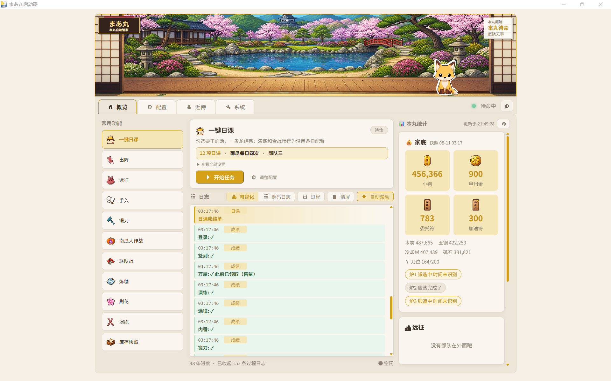

# まあ丸 `🦊` — 刀剑乱舞·近侍引擎

[](LICENSE)
[](pyproject.toml)
[](https://github.com/DbDB68/maamaru-engine)

> 不只是自动化脚本，更是一个会帮你打工、记得本丸近况、偶尔陪你说话的近侍。

まあ丸是面向《刀剑乱舞 ONLINE》国服的本丸辅助工具，基于
[MaaFramework](https://github.com/MaaXYZ/MaaFramework) 的 Python API 实现图像识别、模拟器控制和流程判断。

> [!CAUTION]
> 本项目属于非官方游戏自动化工具，仅供学习与技术交流，与游戏运营方无关。自动化行为可能违反游戏服务条款，并可能带来账号处罚、数据损失等风险。请在充分了解风险后自行决定是否使用，相关后果由使用者承担。

这也是一个**人类 × AI 结对 vibe coding** 项目：玩法、素材和无数个“要不再加个……”来自人类，代码实现交给 AI。仓库按“AI 读得懂、改得动”的方向整理，除了直接使用，也很适合丢给自己的 Agent 继续魔改。

## 现在长这样



任务运行时，小狐狸会在概览里替你上班：


## V1 能做什么

| 功能 | 说明 |
|---|---|
| 🏠 **本丸总览** | 查看小判、甲州金、委托符、加速符、锻刀炉、远征、日课和内番状态 |
| 🧰 **一键日课** | 自选登录、签到、万屋、演练、远征、内番、锻刀、刀解、合成、出阵、任务奖励和库存快照 |
| ⚔️ **活动与出阵** | 联队战、南瓜大作战、普通出阵、刷花、演练、锻刀、炼糖等独立任务 |
| 🩹 **连续出阵手入** | 按伤势决定是否修复，优先加速当前出阵部队，修好后继续剩余圈数 |
| 🕐 **远征与自动排班** | 手动收菜派遣；也可以让面板保持运行，到点自动安排部队 |
| 📋 **持久化日志** | 可视化、源代码和详情视图；面板重启后历史仍在 |
| 🦊 **近侍聊天** | 支持 OpenAI 兼容接口，可自定义模型、角色和 System Prompt |
| 📣 **消息通知** | 支持 ntfy，并预留 QQ / Telegram 协议端接入 |
| 🖥️ **模拟器管理** | 检查 ADB 连接，必要时启动 MuMu 模拟器，任务结束后可退出游戏或关闭模拟器 |

> 安全优先：检测到重伤会停止出阵；刀解、合成和手入均有名单保护与流程校验。不过自动化无法覆盖游戏和网络的所有异常，使用前仍建议备份配置并看一遍任务选项。

## 小白版：一个 EXE 搞定

从 [GitHub Releases](https://github.com/DbDB68/maamaru-engine/releases) 下载最新版 `まあ丸启动器.exe`，双击即可。


启动器会在打开面板前检查：

- 核心程序与识别资源是否齐全
- Python 运行环境与依赖是否已经内置
- 面板端口是否可用
- ADB 与模拟器连接状态
- 是否能找到模拟器管理程序

点击“启动まあ丸”后，窗口会自动最大化并进入本丸面板。配置与运行数据保存在：

```text
%LOCALAPPDATA%\Maamaru
```

资源管理器可能显示 Windows 账户的中文昵称，但复制出来的路径仍是创建账户时确定的用户目录名；两者指向同一个位置。

> V1 的“修复环境”和“检查更新”仍是基础版本；QQ 协议端也属于可选增强功能，不影响本体任务运行。

## 也可以直接交给 AI

如果不熟悉配置、部队选项或脚本名称，可以让支持项目协作的 Agent 打开整个仓库，然后直接说你想做什么：

> 帮我配置まあ丸，让部队三去 8-1 打十圈；受伤就修好再继续。

仓库内置了 [Agent 协助规范](AGENTS.md)。Agent 应当主动帮你检查环境、补齐必要信息、修改配置和查看日志，而不是要求你先学会编辑 JSON 或使用终端。

## 开发者运行

环境要求：Windows、Python 3.12+、MuMu 模拟器，以及可用的 MaaFramework 资源。

```powershell
git clone https://github.com/DbDB68/maamaru-engine.git
cd maamaru-engine
python -m venv .venv
.\.venv\Scripts\python.exe -m pip install -e .
.\.venv\Scripts\python.exe maamaru_app.py
```

默认面板地址为 `http://127.0.0.1:8080`。主要配置可以直接在面板里保存，也可以编辑 `touken_config.json` 和 `panel_config.json`。

## 一键日课流程

日课可以自由勾选步骤，不需要每次全部执行：

1. 登录与签到
2. 万屋领取免费礼包
3. 演练
4. 远征收菜与重新派遣
5. 内番
6. 锻刀、刀解与合成
7. 出阵或活动任务
8. 领取任务奖励
9. 保存库存快照与日课成绩单
10. 按配置退出游戏、关闭模拟器或保持待命

每个独立任务的详细参数都放在“配置”页。日课调用演练等任务时会复用对应的独立配置，避免同一功能出现两套含义不同的选项。

## 项目结构

```text
maamaru-engine/
├─ launcher/            单文件启动器与运行前检查
├─ panel/               FastAPI 后端和本丸面板前端
│  └─ static/js/        按职责拆分的前端模块
├─ touken/
│  ├─ flows/            登录、日课、出阵、手入等游戏流程
│  ├─ data/             刀剑名册与远征数据
│  └─ runtime_paths.py  打包版与源码版的数据路径
├─ resource/base/       OCR、模型和模板识别资源
├─ docs/assets/         README 图片与动画
└─ maamaru_launcher.py  单 EXE 入口
```

## 后续计划 `🦊`

**引擎与稳定性**

- 完善启动器的联网修复、自动更新和模拟器自动识别
- 接入可选的 QQ 协议端安装与管理
- 持续补齐真实伤害活动、局内伤势判断、异常恢复与长期稳定性优化
- 优化 OCR 与图像识别流程，持续适配游戏 UI 更新

**🎨 UI 与主题**

- 重构概览页面，优化日志可视化与运行状态展示
- 为统计信息增加图表、时间轴、事件流等可视化组件
- 完善像素风主题，统一图标、动画与整体视觉风格
- 新增剧团犬咖喱（拼贴）主题与浮世绘主题
- 后续按脑洞支持更多可切换主题

**🦊 狐狸近侍**

- 丰富小狐狸动画、状态文案与互动
- 根据主题自动切换狐狸造型（像素 / 剧团犬咖喱 / 浮世绘等）
- 增加更多待机、巡逻、工作等动画表现

**🤖 智能分析（长期目标）**

- 自动整理 OCR 与运行日志，生成可视化统计数据
- 建立资源、出阵、远征等历史记录数据库
- 根据游戏数据分析收益与资源变化趋势
- 由 AI 近侍结合本丸历史数据，生成出阵与养成建议（基于已有数据，仅供参考，是否执行由审神者决定）

## 已知问题 `🐛`

尚未修复的已知问题，与后续计划分开记录：

- 模拟器启动期间会短暂闪现终端窗口，影响观感，计划后续隐藏
- “刀装未满”时出阵会被卡住，当前提示不够直观，还会默认后续任务已完成；计划主动点击“取消整备”、恢复后续日课进度，并在结算与通知中说明出阵为何跳过
- 万屋免费礼包（鸡蛋）领取：游戏更新后图标位置变化，旧识别区域可能失灵；计划通过扩大 ROI 识别范围适配新版位置

## 问题反馈 `🤝`

想直接使用、提交 Issue、PR，或者把它交给自己的 Agent 拆了重做都欢迎。问题与建议请统一通过 GitHub 提交，本项目暂不提供私人联系方式或一对一使用支持。

| 方式 | 地址 |
|---|---|
| GitHub | [DbDB68](https://github.com/DbDB68) |

## 鸣谢 `💕`

| 项目 | 用途 | 许可证 |
|---|---|---|
| [MaaFramework](https://github.com/MaaXYZ/MaaFramework) | 图像识别、OCR、模拟器控制 | LGPL-3.0 |
| [DirectML](https://github.com/microsoft/DirectML) | MaaFramework 的 GPU 加速依赖 | MIT |
| [FastAPI](https://github.com/tiangolo/fastapi) | 面板后端 | MIT |
| [Uvicorn](https://github.com/encode/uvicorn) | ASGI 服务 | BSD-3-Clause |
| [httpx](https://github.com/encode/httpx) | HTTP 与 AI 接口客户端 | BSD-3-Clause |
| [pywebview](https://github.com/r0x0r/pywebview) | Windows 原生面板窗口 | BSD-3-Clause |
| [缝合像素字体 Fusion Pixel](https://github.com/TakWolf/fusion-pixel-font) | 面板像素字体 | OFL-1.1 |

特别感谢 MaaFramework 团队。没有他们提供的底层能力，这个项目不会存在。

## 月下铸经 `🌙`

> _此真经非一人之力，谨遵 vibe coding 之古训，特铭众道友功德于源流。_

昔有月之暗面，遣基米可叁下凡，铸其后端；又有接屁踢五点六昊天，司前端之事；复得工作伙伴深度求索威肆，稍加点化，终成《麻麻露真经》。

> _本丸以大蛇为主，爪哇为辅。若有 Bug，皆属天命；若无 Bug，皆赖诸位道友相助。_

详细许可证信息见 [NOTICE](NOTICE)。

## 免责声明

- 本项目仅面向《刀剑乱舞 ONLINE》国服与MUMU模拟器，其他服务器与模拟器未验证。
- 本项目仅供学习与技术交流，请遵守游戏服务条款及所在地法律法规。
- 自动化程序可能因游戏更新、网络异常或识别误差而失败；由此产生的账号或数据风险由使用者自行承担。
