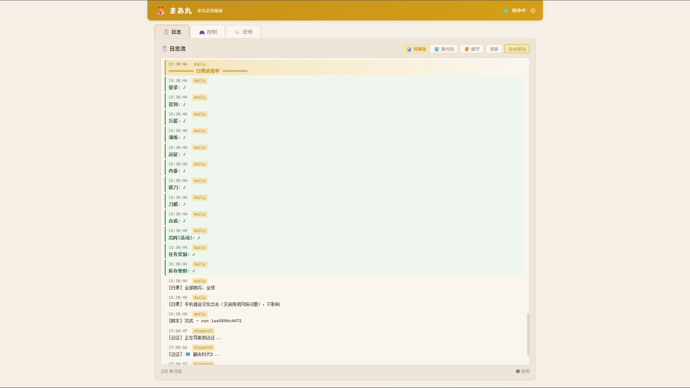
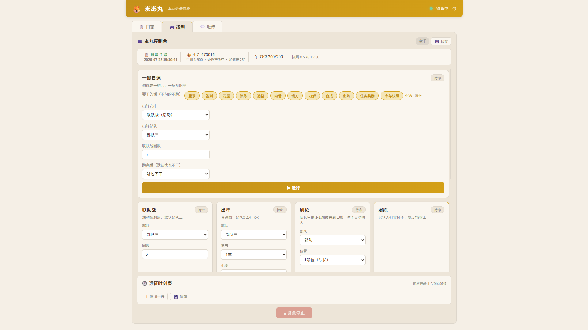

# まあ丸 `🦊` — 刀剑乱舞·近侍引擎

[](LICENSE)
[](pyproject.toml)
[](https://github.com/DbDB68/maamaru-engine)

**不只是自动化脚本，更是你的本丸近侍。**

基于 [MaaFramework](https://github.com/MaaXYZ/MaaFramework)的刀剑乱舞自动托管引擎。模拟器里开着游戏，**他**自己把每天的活儿干了——
现在连模拟器都不用手动开了，ADB 连不上会自动拉 MuMu 起来。

长期目标：成为能跟你聊天、会帮你打工、像游戏里的近侍一样陪在身边的狐之助。

## 近侍面板（网页 GUI）— 推荐




### 小白版（一键包）

下载 [GitHub Release](https://github.com/DbDB68/maamaru-engine/releases) 最新版 zip → 解压 → **双击 `启动面板.bat`** → 浏览器自动打开面板。

首次运行会自动创建虚拟环境、安装依赖，全程不用敲命令。

### 开发者版

```bash
npm run dev        # 一键启动，绑定 0.0.0.0，手机也能连
```
或者：
```bash
./.venv/Scripts/python.exe -m panel.server --port 8080
```

打开 http://localhost:8080（手机跟电脑同一 WiFi 就访问电脑 IP:8080）。

**面板能干什么：**

| 功能 | 说明 |
|------|------|
| 📋 **日志流** | 实时滚动，分级着色，支持可视化/源代码两种模式，Ctrl+C 后历史还在 |
| 🎮 **控制台** | 每张脚本卡片带参数表单，日课可**勾选步骤**，出阵可选打联队战还是推图 |
| 💬 **近侍聊天** | 狐之助角色扮演，配好 OpenAI API Key 就能聊天（暂未测试，待折腾） |
| 🕐 **远征时刻表** | 自己排"几时几分 部队x 去 x-x"，到点自动派遣（面板开着才会派） |
| 💾 **设置持久化** | 点「保存」按钮把参数存到服务器文件，面板重启不丢 |

已注册脚本：一键日课（可勾选步骤）、联队战、出阵推图、刷花、演练、远征收菜、锻刀（支持限锻时长盯梢）、炼糖、库存快照。

AI Key 填在 `panel/panel_config.json`：
```json
{
  "ai": {
    "api_key": "sk-your-key-here",
    "base_url": "https://api.openai.com/v1",
    "model": "gpt-4o-mini"
  }
}
```

## 快速安装（作为 pip 包）

```bash
pip install maamaru-engine
```

需要额外下载资源包（OCR 模型 + 模板图）放在项目目录的 `resource/base/` 下：
→ [GitHub Releases 下载 resource.zip](https://github.com/你的用户名/maamaru/releases)

使用示例：

```python
from touken import MAAAdapter, ToukenAgent

maa = MAAAdapter(
    adb_path="D:/MUMU/.../adb.exe",
    adb_address="127.0.0.1:16384",
    resource_dir="./resource/base",
)

if not maa.init():
    exit(1)

agent = ToukenAgent("touken_config.json", maa)

for msg in agent.daily_stream():
    print(msg)
```

`touken_config.json` 现在支持在顶层配 ADB 和 MuMuManager 路径：

```json
{
  "adb_path": "D:\\MUMU\\MuMuPlayer\\nx_device\\12.0\\shell\\adb.exe",
  "adb_address": "127.0.0.1:16384",
  "emulator_manager": "D:\\MUMU\\MuMuPlayer\\nx_main\\MuMuManager.exe",
  "emulator_instance": 0
}
```

## 每天自动跑什么

一键日课（`daily_stream`）：

1. **登录** — 游戏没开会自己点图标冷启动；ADB 连不上会自动拉模拟器；顺手关公告/推完结算动画
2. **签到**
3. **万屋领免费鸡蛋**（暖心礼包，自动验证价格 0 才点）
4. **演练** — 认人避战：躲极短队和丙子椒林剑，赢够 3 场收工
5. **远征** — 收菜 + 自动派回原图
6. **内番** — 安排上工
7. **锻刀** — 每日 3 炉，收完成的点空闲的，刀位满自动刀解腾位置
8. **刀解** — 白名单一把（今天锻刀腾位置解过了就自动跳过这步）
9. **合成** — 白名单喂一把
10. **出阵** — 联队战 3 圈 / 推图 / 不打 均支持配置或面板动态传
11. **领任务奖励**
12. **库存快照** — 读甲州金（顶栏那个！）+ 真小判（从所持道具界面读）
13. **收尾** — 可选：退出游戏 / 关模拟器 / 电脑休眠

**日课高级参数（通过面板或代码传入）：**

```python
# 只跑签到和锻刀
for msg in agent.daily_stream(only=["签到", "锻刀"]):
    print(msg)

# 跑完退出游戏 + 关模拟器 + 电脑休眠
for msg in agent.daily_stream(after="sleep"):
    print(msg)

# 动态覆盖出阵配置（面板传的）
for msg in agent.daily_stream(
    sortie_override={"mode": "sortie", "chapter": 5, "map_no": 3, "loops": 2}
):
    print(msg)
```

炼糖和收件箱不在日课里，是要用了在面板点或手动跑的。

## 手动使唤

| 命令 | 干啥 |
|---|---|
| `test_daily.py` | 手动跑一遍完整日课 |
| `test_daily.py --signin` | 只签到 |
| `test_sakura.py --team 1 --slot 1` | 刷花：队长单挑 1-1 刷疲劳到 100 |
| `test_sugar.py` | 炼糖：收件箱清狗粮 + 习合循环 |
| `test_raid.py` | 单测联队战 |
| `test_practice.py` | 单测演练 |
| `test_expedition.py` | 单测远征收菜 |
| `test_repair.py` | 单测手入（黑名单的不修） |
| `test_smith.py` | 单测锻刀+刀解 |
| `test_synthesize.py` | 单测合成 |
| `test_naihanka.py` | 单测内番 |
| `test_sortie.py` | 单测普通出阵 |

翻车了就再跑一遍——链路是幂等的，做过的步骤会自己跳过。

## 关键功能一览

### 模拟器自启动

配好 `emulator_manager` 后：
- ADB 连不上时自动调用 `MuMuManager launch` 启动实例
- 轮流询安卓开机状态（最长等 6 分钟）
- 系统起来后 `adb connect` + 等 `sys.boot_completed`
- 日课可配置跑完后 `shutdown` 关模拟器或 `sleep` 电脑休眠

### 锻刀限锻盯梢

面板锻刀卡片可以填"目标时长"（如 `03:20:00, 04:00:00`），点火后脚本自动读倒计时，命中目标时长直接手机 ntfy 推送喊你去看炉。

### 自动行军（委托）修复

委托流程现在完整验证三步：点自动行军按钮 → 轮询等委托弹窗出现 → 点委托选中单选框 → 点 X 关闭弹窗才生效 → 验证委托标记出现。不再盲点。

### 库存快照

修复了甲州金 vs 小判的混淆——顶栏数字是甲州金（万屋氪金货币），真小判要去所持道具界面 OCR 读取。

### 日志持久化

所有脚本的 `yield` 消息同时写入 `status/maamaru_logs.db`（SQLite），即使 Ctrl+C 或面板重启，历史日志全在。

## 手机推送（ntfy）

- App：ntfy（蓝铃铛图标），订阅你在 `touken_config.json` 里配的频道
- 频道名就是密码，别外传
- 日课跑完自动推成绩单；限锻命中目标时长也会推喜报

## 文件地图

```
maamaru-engine/
├── touken/                  引擎本体（pip 包）
│   ├── __init__.py          公开 API：ToukenAgent, MAAAdapter
│   ├── agent.py             ToukenAgent 主类（多继承组装）
│   ├── maa_adapter.py       底层：截图/点击/OCR/模板匹配 + 模拟器自启动
│   ├── navigator.py         中层：导航 + 弹窗处理
│   ├── emulator.py          MuMu 模拟器自启动/关闭/休眠
│   ├── sword_db.py          刀剑名册
│   ├── notify.py            ntfy 推送
│   ├── data/                静态数据（刀剑名册、远征收益表）
│   └── flows/               上层：每个玩法一个文件
├── panel/                   近侍面板（独立于 pip 包）
│   ├── server.py            FastAPI 服务 + 所有 API
│   ├── log_store.py         SQLite 日志持久化
│   ├── script_runner.py     后台线程脚本执行器
│   ├── chat_ai.py           狐之助角色 AI 聊天
│   ├── scheduler.py         远征时刻表调度
│   ├── panel_config.json    面板配置（AI Key 等）
│   └── static/              HTML/CSS/JS 前端
├── package.json             npm run dev 启动面板
├── touken_config.json       总配置
├── resource/base/           资源包（OCR 模型 + 模板图，单独下载）
├── test_*.py                使用示例 / 手动入口
├── status/                  运行时数据（成绩单/库存/日志DB/面板设置）
└── debug/                   运行时截图日志
```

## pip 包 vs 完整项目

| | pip 包 `maamaru-engine` | 完整项目（本仓库） |
|---|---|---|
| 内容 | `touken/` 引擎 + `resource/` | 引擎 + 面板 + 测试脚本 + 配置文件 |
| 适合谁 | 想自己写前端的开发者 | 直接用面板的普通用户 |
| 安装 | `pip install maamaru-engine` | `git clone` + `pip install -r requirements.txt` |
| 面板 | 无（可自己接） | 开箱即用 |

## 安全规矩（写死在代码里的）

- 有重伤绝不出阵（会碎刀）
- 上锁的刀不会被刀解/习合选中——**用炼糖前把重要的刀锁好**
- 演练只打软柿子，极短队/丙子队绕着走
- 手入黑名单里的刀不修

## 后续计划 `🦊`  （画个饼）

- **手机遥控** — 出门在外也能远程启动日课、看本丸状态，不用开电脑
- **近侍聊天完善** — AI 狐之助正式上线测试
- **更多自动化** — 活动图自动适配、限锻自动盯着出刀就停手
- **一键包** — 面向小白的免配置发行版（已完成！下载 Release → 双击 `启动面板.bat`）

## 致谢 `💕`

本项目的核心图像识别 + 自动化执行能力完全依托以下开源项目：

| 项目 | 角色 | 许可证 |
|------|------|--------|
| [**MaaFramework**](https://github.com/MaaXYZ/MaaFramework) | 图像识别 + 模拟器控制 + OCR，本项目直接调用其 Python 接口 | LGPL-3.0 |
| [DirectML](https://github.com/microsoft/DirectML) | GPU 加速（由 MaaFramework 间接引入） | MIT（微软） |
| [FastAPI](https://github.com/tiangolo/fastapi) | 面板后端 HTTP/SSE 服务 | MIT |
| [Uvicorn](https://github.com/encode/uvicorn) | ASGI 服务器 | BSD-3 |
| [httpx](https://github.com/encode/httpx) | OpenAI API 客户端 | BSD-3 |
| [Python](https://www.python.org/) | 解释器 | PSF |

详细许可证文本见 `NOTICE` 文件。

> 特别感谢 MaaFramework 团队——没有他们的辛苦工作，就没有这个项目。本项目仅魔改调用其 Python 接口。

## ⚠️ 免责声明

- 本脚本仅面向 **国服**（游族/渠道服），日服未测试
- 使用脚本导致的账号封禁等后果由用户自行承担
- 仅供学习交流，请在下载后 24 小时内删除
