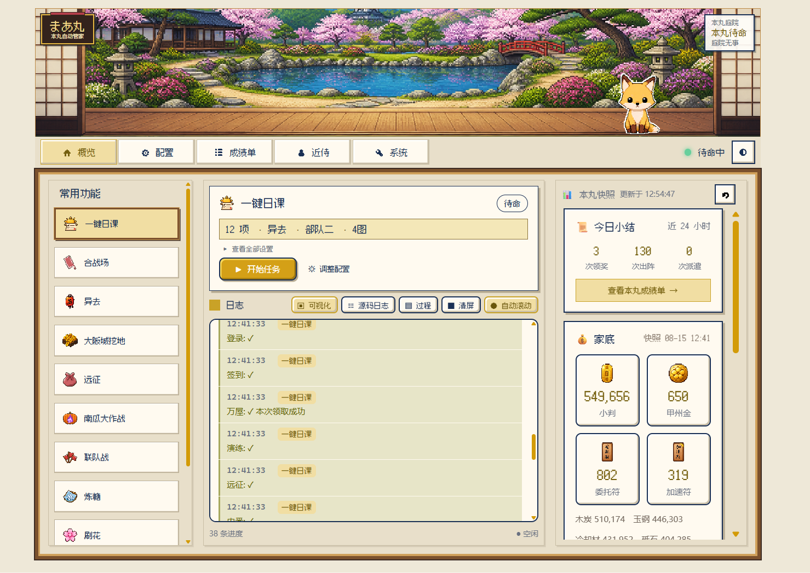
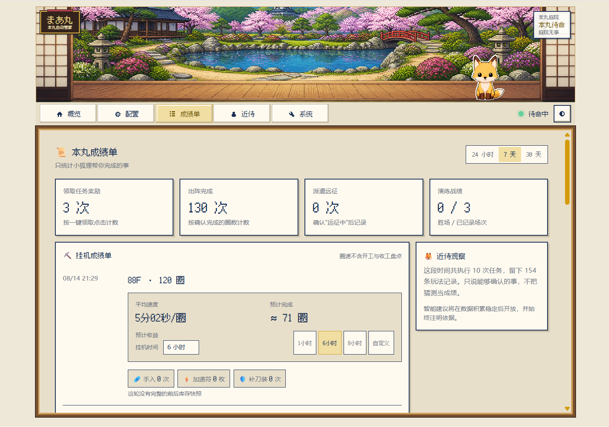
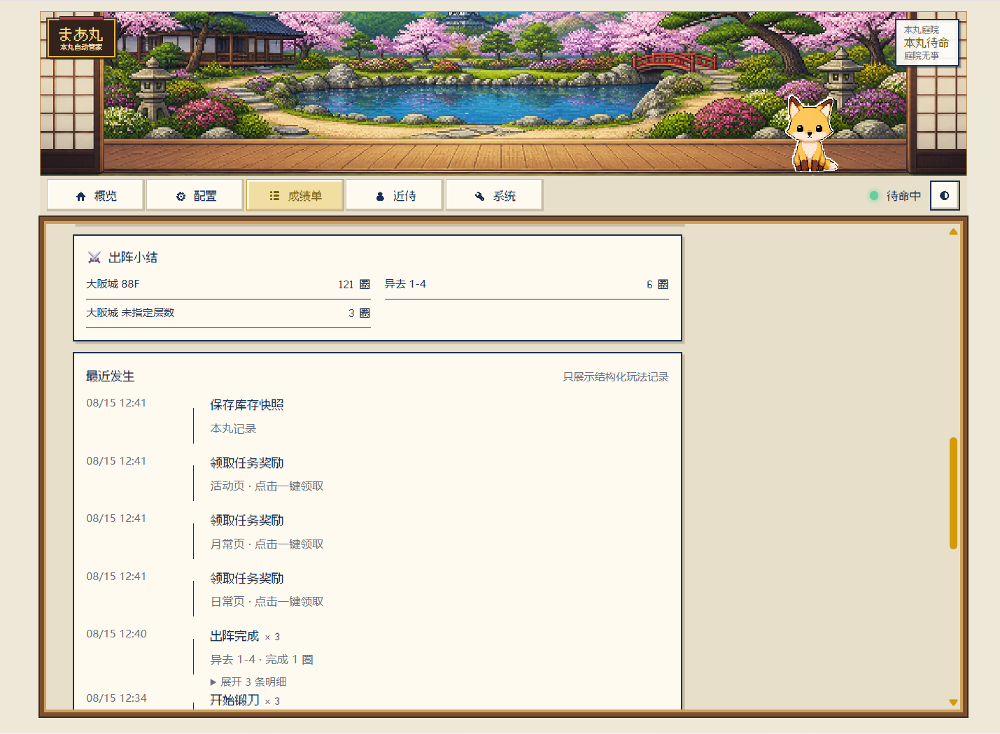
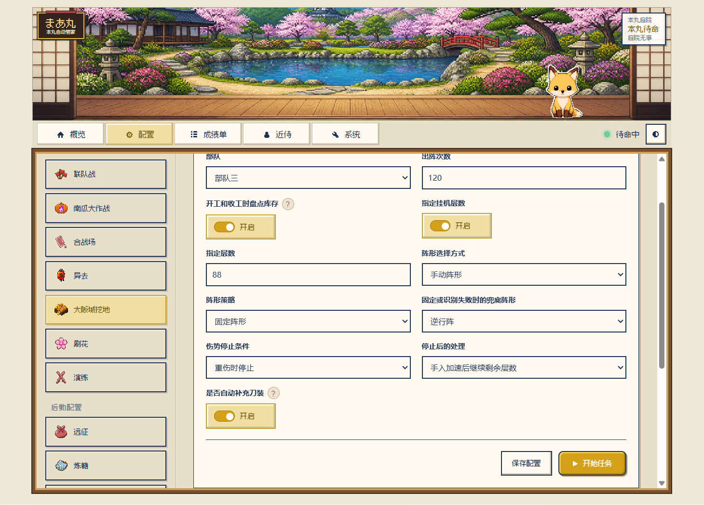

# まあ丸 `🦊` — 刀剑乱舞·近侍引擎

[](LICENSE)
[](pyproject.toml)
[](https://github.com/DbDB68/maamaru-engine)

まあ丸是面向《刀剑乱舞 ONLINE》国服的自动化辅助工具，基于
[MaaFramework](https://github.com/MaaXYZ/MaaFramework) 的 Python API，提供日课、远征、出阵与活动挂机等流程自动化，并记录本丸运行数据，帮助玩家了解长期运营状态。

> 不只是自动化脚本，更是一个会帮你打工、记得本丸近况、偶尔陪你说话的近侍。

这也是一个**人类 × AI 结对 vibe coding** 项目：玩法、素材和无数个“要不再加个……”来自人类，代码实现交给 AI。仓库按“AI 读得懂、改得动”的方向整理，除了直接使用，也很适合丢给自己的 Agent 继续魔改。

> [!CAUTION]
> 本项目属于非官方游戏自动化工具，仅供学习与技术交流，与游戏运营方无关。自动化行为可能违反游戏服务条款，并可能带来账号处罚、数据损失等风险。请在充分了解风险后自行决定是否使用，相关后果由使用者承担。


## 现在长这样



首页把任务、可视化日志、本丸快照和今日小结放在同一张工作台上。任务运行时，小狐狸也会换到对应场景替你上班。

（旧版演示，暂已绝版，舍不得删）

## V2 能做什么

| 功能 | 说明 |
|---|---|
| 🏠 **本丸工作台** | 同屏查看当前任务、可视化日志、小判与资源、远征、日课、锻刀炉和内番状态 |
| 🧰 **一键日课** | 自选登录、签到、万屋、演练、远征、内番、锻刀、刀解、合成、出阵、任务奖励与库存快照；远征会按“常用安排”收菜再派出 |
| ⚔️ **出阵与活动** | 普通合战场、异去、联队战、南瓜大作战、大阪城挖地、刷花和演练均可独立运行 |
| 📜 **本丸成绩单** | 按结构化记录汇总出阵、演练、远征、任务奖励、手入、加速符、补刀装和库存变化，并提供圈速与挂机时长估算 |
| ⛏️ **大阪城定层挂机** | 可指定 1～99F 和出阵圈数；例如固定 88F 连续挖地，而不是只能从一点进去的99F开始 |
| 🛡️ **连续作战恢复** | 刀装破损时从部队记录自动补充；触发伤势条件后可手入、使用加速符，并继续没有跑完的圈数 |
| 🩹 **名单保护** | 手入、刀解与合成都有保护名单；特殊刀或不想动的刀可以明确排除，不因自动流程被处理 |
| 🥊 **会挑人的演练** | 识别演练对手信息，优先挑选更容易处理的目标，并记录可确认的胜负结果 |
| 🕐 **远征与排班** | 独立远征可收菜、等待临近归来的队伍并按常用安排派遣；自动排班则在设定时间接管，两套配置互不混用 |
| 📋 **持久化日志** | 可视化、源码和过程视图；重复事件可折叠，面板重启后历史仍在 |
| 🖥️ **运行保护** | 检查 ADB 与模拟器状态；子进程卡死时由看门狗收尾；任务结束后可保持待命、退出游戏、关闭模拟器或休眠 |

> 安全优先：检测到重伤会停止出阵；刀解、合成和手入均有名单保护与流程校验。不过自动化无法覆盖游戏和网络的所有异常，使用前仍建议备份配置并看一遍任务选项。

### 成绩单：只记小狐狸确认完成的事



成绩单会按每次任务的 `run_id` 汇总。大阪城等循环任务可以查看实测平均圈速，选择 1 小时、6 小时、8 小时或自定义时长估算圈数；手入、加速符和补刀装只在流程明确完成后计数。库存前后都成功截图识别时，才展示小判和资源差值。

它像 Notion 或 Excel 拉表一样，是まあ丸干活时顺手完成的本地辅助统计；不会读取游戏账号后台，也无法覆盖玩家手动操作或尚未识别的玩法。

重复记录会折叠成事件流，需要时再展开查看每圈时间和序号：



任务奖励也不是“点过按钮就算成功”：まあ丸会区分橙色可领取按钮和灰色空状态，点击后确认按钮变灰才计入成绩。无法确认的事情会明确标成未确认，不拿猜测凑数字。

### まあ丸自己的作战习惯



- **指定层数与次数**：大阪城可固定目标层挂机，并按配置圈数收工。
- **坏刀装就补**：出阵前保存部队记录，刀装破损时自动恢复后继续。
- **受伤修好再跑**：按轻伤／中伤／重伤阈值停止，支持加速手入后继续剩余圈数。
- **特殊刀不乱碰**：手入黑名单、刀解白名单和合成保护共同限制资源操作。
- **演练先挑软柿子**：读取对手信息后选择目标，不只是从上到下盲打。
- **远征分清“现在派”和“到点派”**：一键日课复用独立远征的常用安排；自动排班保持独立，避免配置互相打架。

> [!NOTE]
> 当前版本由维护者实机连续跑过 **大阪城 88F × 120 圈**，该轮完整结束，但未触发手入或补刀装。一次长跑不能覆盖所有账号、阵容、网络和活动状态；跑得比维护者还多的审神者如果遇到问题，欢迎带日志提交 Issue。

## 小白版：安装包搞定

从 [GitHub Releases](https://github.com/DbDB68/maamaru-engine/releases) 下载最新版
`maamaru-setup-v*.exe`，按提示安装即可。想免安装使用，也可以下载同版本的
`maamaru-launcher-v*.zip`，解压后双击 `まあ丸启动器.exe`。


启动器会在打开面板前检查：

- 核心程序与识别资源是否齐全
- Python 运行环境与依赖是否已经内置
- 面板端口是否可用
- ADB 与模拟器连接状态
- 是否能找到模拟器管理程序

点击“启动まあ丸”后，启动器会在同一个窗口进入本丸面板；窗口使用适合三栏面板的尺寸，不再默认铺满整个屏幕。配置与运行数据保存在：

```text
%LOCALAPPDATA%\Maamaru
```

资源管理器可能显示 Windows 账户的中文昵称，但复制出来的路径仍是创建账户时确定的用户目录名；两者指向同一个位置。

“重新检查”会刷新当前环境状态；“修复环境”可恢复损坏的本地配置，并在源码运行时补装缺失依赖；“检查更新”会比较当前版本与 GitHub Release，安全下载并校验官方安装包，经你确认后再打开安装向导。QQ 协议端属于可选增强功能，不影响本体任务运行。

安装和更新只替换程序文件，不会删除 `%LOCALAPPDATA%\Maamaru` 中的配置、排班、日志与识别素材。

## 也可以直接交给 AI

如果不熟悉配置、部队选项或脚本名称，可以让支持项目协作的 Agent 打开整个仓库，然后直接说你想做什么：

> 帮我配置まあ丸，让部队三去 8-1 打十圈；受伤就修好再继续。

仓库内置了专门面向使用场景的 [まあ丸 Agent 使用协助规范](docs/agent-user-guide.md)。把仓库交给 Agent 时，可以请它先阅读这份说明；它应当主动帮你检查环境、补齐必要信息、修改配置和查看日志，而不是要求你先学会编辑 JSON 或使用终端。

根目录的 `AGENTS.md` 则只用于まあ丸本身的开发和维护，两种协作方式互不串台。

## 开发者运行

环境要求：Windows、Python 3.12+、MuMu 模拟器，以及可用的 MaaFramework 资源。

```powershell
git clone https://github.com/DbDB68/maamaru-engine.git
cd maamaru-engine
python -m venv .venv
.\.venv\Scripts\python.exe -m pip install -e .
.\.venv\Scripts\python.exe maamaru_app.py
```

默认面板地址为 `http://127.0.0.1:8080`。主要配置可以直接在面板里保存。安装版用户数据位于 `%LOCALAPPDATA%\Maamaru`，源码开发数据位于 `%LOCALAPPDATA%\Maamaru-Dev`；仓库只保存不含个人路径与通知信息的配置模板。

程序文件与用户数据严格分开。旧版放在 EXE 或项目目录旁的配置会在首次启动时复制到新目录并留下备份，原文件不会自动删除。详细结构和迁移规则见 [`docs/data-layout.md`](docs/data-layout.md)。
识别模板与 OCR 模型已经随仓库提供，克隆后不需要另外寻找资源包。

## 项目结构

```text
maamaru-engine/
├─ launcher/            单文件启动器与运行前检查
├─ panel/               FastAPI 后端和本丸面板前端
│  ├─ frontend/         Vue 3 + TypeScript 主前端
│  └─ static/           构建产物、旧版兼容页面与共用素材
├─ touken/
│  ├─ flows/            登录、日课、出阵、异去、大阪城、手入等游戏流程
│  ├─ data/             刀剑名册与远征数据
│  └─ runtime_paths.py  打包版与源码版的数据路径
├─ resource/base/       OCR、模型和模板识别资源
├─ docs/assets/         README 图片与动画
└─ maamaru_launcher.py  单 EXE 入口
```

## 后续计划 `🦊`

**引擎与稳定性**

- 完善启动器的联网修复、自动更新和模拟器自动识别
- 增加王点识别，并支持常驻合战场在进入王点前主动撤退，避免误刷出检非违使
- 持续补齐真实伤害活动、局内伤势判断、断线／弹窗恢复与长期挂机稳定性
- 优化 OCR 与图像识别流程，持续适配游戏 UI 更新
- 扩大不同分辨率、账号进度、部队编成和活动状态下的实机验证范围

**🎨 UI 与主题**

- 继续优化新版 Vue 面板的信息层级、窄屏布局和无障碍体验
- 为成绩单增加资源趋势、周报和更直观的图表视图
- 继续统一像素主题的图标、组件和动画，同时保证长文本可读性
- 新增剧团犬咖喱（拼贴）主题与浮世绘主题
- 后续按脑洞支持更多可切换主题

**🦊 狐狸近侍**

- 丰富小狐狸动画、状态文案与互动
- 根据主题自动切换狐狸造型（像素 / 剧团犬咖喱 / 浮世绘等）
- 增加更多待机、巡逻、工作等动画表现
- 完成 LLM 聊天、QQ、Telegram／纸飞机协议端的实机测试、故障隔离和使用说明

**📊 本丸数据与智能建议**

数据地基与第一版成绩单已经完成：まあ丸会悄悄记下任务完成情况、大阪城进度、演练胜负、远征、锻刀、手入、活动掉落和库存快照等结构化记录，不再从中文日志里“猜”发生了什么。

这些记录只保存在审神者自己的用户数据目录中，不保存游戏截图，默认保留 90 天；即使记录失败，也不会影响正在执行的任务。

接下来计划逐步完成：

- 继续补齐活动板子、手形／令牌、锻刀结果和更多可确认事件的统计口径
- 用多次库存快照展示小判、道具与四资源的长期变化趋势，并帮助发现异常消耗
- 让近侍根据本丸历史数据整理周报、活动收益和可执行的出阵／养成建议
- 为每条统计和建议注明数据范围、缺失项与推断依据，不把估算包装成官方结论
- 所有智能建议只作参考，由审神者确认后执行，不让 AI 擅自动用资源、修改名单或改变排班

开发者可以查看 [结构化运行数据说明](docs/telemetry-data.md)，直接使用现有数据接口继续搭建前端统计，不需要解析中文日志。

## 已知问题 `🐛`

尚未修复的已知问题，与后续计划分开记录：

- 近侍聊天、QQ 与 Telegram／纸飞机相关能力尚未完成维护者实机验证
- 游戏更新后若界面布局、按钮颜色或文案变化，识别素材与范围可能需要重新适配
- 成绩单统计演练时暂无法认出胜利场次。

## 问题反馈 `🤝`

想直接使用、提交 Issue、PR，或者把它交给自己的 Agent 拆了重做都欢迎。问题与建议请统一通过 GitHub 提交，本项目暂不提供私人联系方式或一对一使用支持。

| 方式 | 地址 |
|---|---|
| GitHub | [DbDB68](https://github.com/DbDB68) |

## 鸣谢 `💕`

| 项目 | 用途 | 许可证 |
|---|---|---|
| [MaaFramework](https://github.com/MaaXYZ/MaaFramework) | 图像识别、OCR、模拟器控制 | LGPL-3.0 |
| [DirectML](https://github.com/microsoft/DirectML) | MaaFramework 的 GPU 加速依赖 | MIT |
| [FastAPI](https://github.com/tiangolo/fastapi) | 面板后端 | MIT |
| [Uvicorn](https://github.com/encode/uvicorn) | ASGI 服务 | BSD-3-Clause |
| [httpx](https://github.com/encode/httpx) | HTTP 与 AI 接口客户端 | BSD-3-Clause |
| [pywebview](https://github.com/r0x0r/pywebview) | Windows 原生面板窗口 | BSD-3-Clause |
| [缝合像素字体 Fusion Pixel](https://github.com/TakWolf/fusion-pixel-font) | 面板像素字体 | OFL-1.1 |

特别感谢 MaaFramework 团队。没有他们提供的底层能力，这个项目不会存在。
详细许可证信息见 [NOTICE](NOTICE)。
## 开发模式 `🐂`

本项目内部采用 **MCS（Multi-Cow System，多牛协同生产系统）**：把不同类型的工作交给上下文互相隔离的专业牛，各自积累任务记忆，最后由人类在牛群之间传话、拍板和验收。

- 🐂 **前端牛**：UI 与交互
- 🐂 **脚本牛**：自动化逻辑与故障恢复
- 🐂 **IT 外包牛**：环境、打包与系统维护
- 🐂 **简历牛**：负责把前面几头牛包装成人类就业竞争力

为什么都是牛？因为 Codex 的桌宠叫 **NULL**，读快了很像“牛”。没有 README 牛；README 是人类和路过的牛一起写的。

这不是正式的软件架构名，但“把大任务拆给彼此隔离的工作区，再由人类传递信息和决策”确实是本仓库日常开发方式。简历里不准出现 MCS，README 里可以。

## 月下铸经 `🌙`

> _此真经非一人之力，谨遵 vibe coding 之古训，特铭众道友功德于源流。_

昔有月之暗面，遣基米可叁下凡，铸其后端；又有接屁踢五点六昊天，司前端之事；复得工作伙伴深度求索威肆，稍加点化，终成《麻麻露真经》。

> _本丸以大蛇为主，爪哇为辅。若有 Bug，皆属天命；若无 Bug，皆赖诸位道友相助。_
