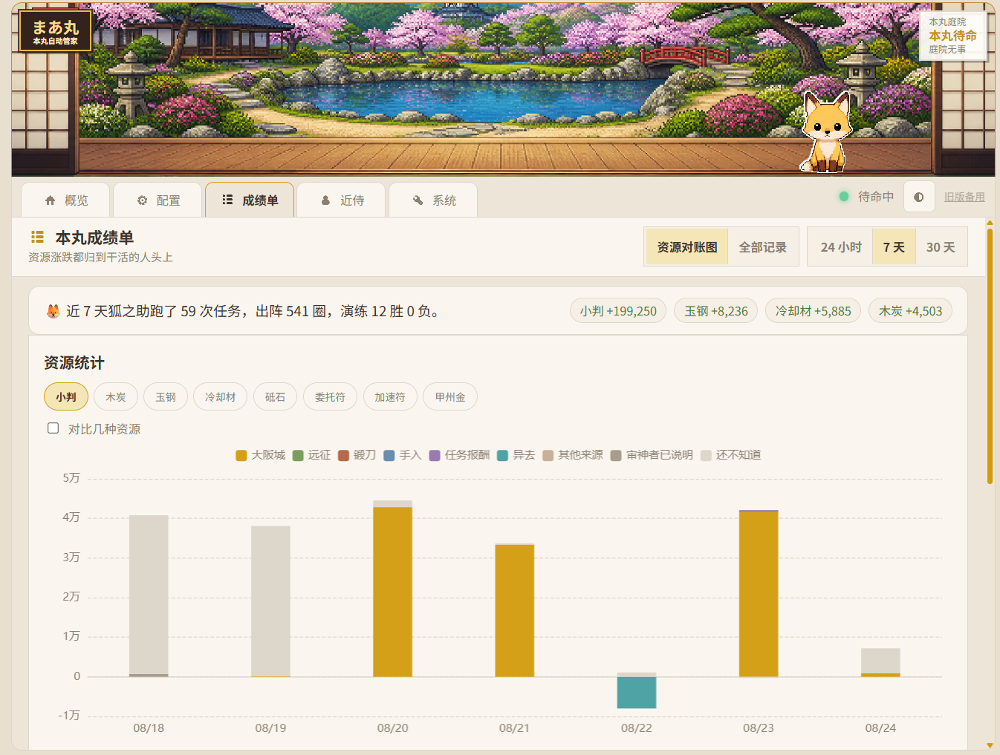
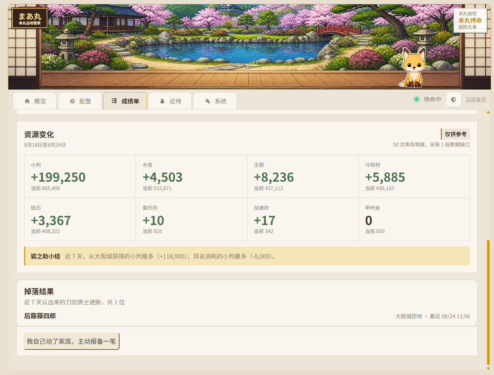
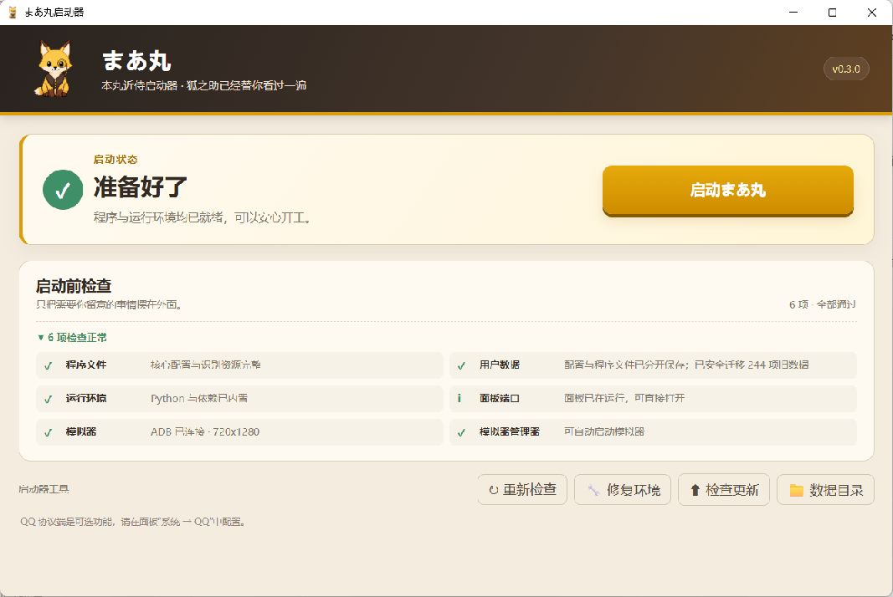

# まあ丸 `🦊` — 刀剑乱舞国服自动化辅助工具

[](LICENSE)
[](pyproject.toml)
[](https://github.com/DbDB68/maamaru-engine)

まあ丸用于在 MuMu 模拟器上执行《刀剑乱舞 ONLINE》国服的日课、远征、出阵和活动任务。玩家决定目标、部队、伤势条件、资源消耗和保护名单；まあ丸负责按这些规则执行、观察结果、处理部分中断，并把能够确认的任务与资源变化记进本丸成绩单。

**入口：** [下载最新版](https://github.com/DbDB68/maamaru-engine/releases/latest) · [使用说明](docs/user-manual.md) · [版本记录](docs/releases/) · [提交问题](https://github.com/DbDB68/maamaru-engine/issues)

> [!CAUTION]
> 本项目是非官方游戏自动化工具，与游戏运营方无关。自动化行为可能违反游戏服务条款，并带来账号处罚、误操作或数据损失等风险。请自行判断是否使用并承担相应后果。

> [!NOTE]
> **项目状态：持续维护中**
>
> 当前主要支持 MuMu 12 与 1280×720 游戏画面，已经过维护者长期实机运行，也有非技术用户完成安装和日常使用。游戏更新、新地图、不同模拟器或分辨率仍可能影响画面识别；第一次使用新任务或更换运行环境时，建议先短跑确认伤势处理和停止条件。

## 界面



成绩单可比较多种资源、查看确定来源与未归因变化，并按日期下钻到当天任务和记录。

<details>
<summary>查看资源变化与全部记录</summary>




</details>

## 目前可以做什么

### 日课、出阵与独立任务

| 功能 | 当前行为 |
|---|---|
| **一键日课** | 自选登录、签到、万屋、演练、远征、内番、锻刀、刀解、合成、出阵、任务奖励和库存快照；出阵可选联队战、南瓜、异去、大阪城或普通合战场 |
| **普通合战场** | 选择章节、小图、部队和圈数；可用游戏自动行军或脚本手动行军，并设置阵形、伤势停止条件和收尾方式 |
| **异去** | 当前支持第一章 1～4 图，可设置圈数、提灯补充、行军、伤势处理、补刀装和自动换队长 |
| **大阪城挖地** | 从当前进度逐层向下，或指定 1～99F 连续挂机；支持阵形、伤势处理、手入续跑、补刀装和小判收益实验记录 |
| **联队战** | 按次数出阵；手形不足时可选择停止，或明确允许使用小判补充 |
| **南瓜大作战** | 按目标名单识别剪影和获得角色，可在令牌预算内换板；当前不会自动购买补充令牌 |
| **刷花与演练** | 刷花会让指定位置单挑 1-1，疲劳满后自动换人；演练会读取对手阵容，优先挑战更容易处理的目标并记录可确认的胜负 |
| **远征与排班** | 立即收取归来奖励、等待临近归来的部队并按常用安排再派；也可以按时刻表在设定时间接管已打开的游戏 |
| **锻刀** | 收取已完成的刀，再给空闲炉点火，不使用加速符；可配置目标时长，命中时通过已配置的通知渠道报喜 |
| **炼糖** | 从收件箱领取刀剑并循环习合；上锁刀无法被一键选择，达到安全上限后停止 |
| **库存快照** | 手动读取完整家底并刷新看板；日常运行会在锻刀收工和顶栏巡查时顺路更新，通常不需要专程执行 |

详细选项和操作顺序见 [まあ丸使用说明](docs/user-manual.md)。

### 战斗中的安全与恢复

- **确认再继续**：确认页面、按钮和任务结果，不把“点过”直接当成“完成”。
- **重伤保护**：确认重伤时不会强行出阵；也可以按轻伤、中伤或重伤设置更早的停止条件。
- **手入续跑**：达到条件后可选择手入加速并继续剩余圈数、手入后停止，或直接停止且不手入。
- **补刀装**：合战场、异去和大阪城均可独立开启；只有实际出现“刀装未满”提示时才按开工前保存的队伍记录恢复。
- **自动换队长**：合战场和异去可按 5、10 或 20 点疲劳差，在每圈出阵前把疲劳最低的成员换到队长位；读取或拖动不可靠时不强行调整。
- **王点前撤退**：普通合战场关闭自动行军后，可根据小地图判断下一步是否进入王点并主动返回本丸；无法确认时继续普通行军。它不能移除已经出现的检非违使。
- **名单保护**：手入使用黑名单，刀解使用白名单，合成与活动目标也有各自的允许范围。
- **中断恢复**：连续作战可保留剩余进度；网络超时会尝试恢复，子进程长时间无进展时由看门狗结束任务，避免整夜卡死。
- **结束动作**：任务完成后可保持待命、退出游戏、关闭模拟器，或在明确选择后让电脑休眠。

使用游戏自动行军时，路线和阵形由游戏处理，まあ丸只观察完成或停止状态；手动行军时才由まあ丸选择阵形和处理岔路。

### 本丸成绩单与资源账

成绩单分为 **战报 / 资源账 / 全部记录**：

- 战报汇总最近任务、出阵用时、圈速、养护、大阪城小判实验和演练结果。
- 资源账比较木炭、玉钢、冷却材、砥石、小判、甲州金、委托符和加速符，可按 24 小时、7 天、30 天或 1 年查看，并下钻到单日明细。
- 全部记录按日期显示统一时间线；连续出阵、远征收取和任务奖励会整理成玩家活动，不拿一长串机器事件占满页面。
- 流程确认的收支、库存实际变化和玩家补充说明分开保存。无法解释的差值会留在账上，不会强行塞进某一轮任务。
- 轻量任务记录与玩家说明长期保留；体积较大的 OCR 观察明细默认保留 90 天。

这些记录只保存在本机用户数据目录中，不保存游戏截图。成绩单记录失败不会中断正在执行的任务。

### 启动器与用户数据



- 新安装会尝试自动发现 MuMu 12 的 ADB 与管理器；找不到时可以手动选择模拟器目录。
- 启动前检查模拟器、ADB、运行环境和端口；下载更新时显示真实进度，网络失败可重试。
- “迁移数据”会先复制并逐文件校验，再切换到新目录；原目录继续保留，未经确认不会删除。
- 面板和启动器都能导出脱敏反馈包。反馈包只包含版本、系统摘要与文本日志，不收集配置、密钥、库存、状态数据库或截图。
- 安装和更新只替换程序文件，不删除配置、排班、日志、成绩单或识别素材；卸载时会询问是否保留用户数据。

## 下载与开始

从 [GitHub Releases](https://github.com/DbDB68/maamaru-engine/releases) 下载最新版：

- `maamaru-setup-v*.exe`：安装版；
- `maamaru-launcher-v*.zip`：免安装版，解压后运行 `まあ丸启动器.exe`。

打开启动器，等待检查完成，再点击“启动まあ丸”。第一次运行前请阅读 [まあ丸使用说明](docs/user-manual.md)，至少确认模拟器、分辨率、部队、资源消耗、伤势条件和保护名单。

安装版默认用户数据目录：

```text
%LOCALAPPDATA%\Maamaru
```

源码开发版默认使用 `%LOCALAPPDATA%\Maamaru-Dev`，避免与安装版的配置和成绩单混用。两者都使用本机 `8080` 端口，不要同时运行。

## 与 Agent 协作

如果不熟悉任务配置、部队选项或日志，可以让支持仓库协作的 Agent 打开项目，并请它先阅读 [まあ丸 Agent 使用协助规范](docs/agent-user-guide.md)。这份说明用于告诉外部 Agent 怎样检查环境、修改配置和定位停止原因，避免先让玩家学习 JSON 或终端命令。

まあ丸本身也采用人类与 AI 协作开发：人类负责提出真实场景、定义玩法规则和安全边界、准备识别素材、判断方案并实机验收；Kimi Code、Codex、WorkBuddy 等工具协作推进代码实现和问题修复。仓库保留需求、版本记录、测试与发布历史，便于继续检查和迭代。

## 当前边界

- 主要验证环境是 MuMu 12 与 1280×720；其他模拟器、分辨率和缩放比例可能需要重新适配识别范围。
- 异去目前只开放第一章；联队战当前主要按 4 图配置；季节活动入口和规则变化后可能需要更新。
- 南瓜大作战的令牌自动购买仍禁用，令牌不足时安全结束。
- 王点前撤退、疲劳读取、拖动换队长和掉线恢复都依赖真实画面；首次使用新地图或新环境时应短跑观察。
- 近侍聊天、QQ 与 Telegram／纸飞机相关能力尚未完成维护者实机验证，不作为当前主要使用入口。
- 紧急停止会直接结束任务进程，无法保证执行收工盘点或回到本丸；停止后请先查看模拟器当前页面。

## 开发者运行

环境要求：Windows、Python 3.12+、MuMu 模拟器和 ADB。MaaFramework、OCR 模型与识别模板随项目依赖或仓库资源提供。

```powershell
git clone https://github.com/DbDB68/maamaru-engine.git
cd maamaru-engine
python -m venv .venv
.\.venv\Scripts\python.exe -m pip install -e .
.\.venv\Scripts\python.exe maamaru_app.py
```

默认面板地址为 `http://127.0.0.1:8080`。主要配置可以直接在面板中保存。程序文件与用户数据严格分开，旧目录迁移会先复制和备份，不自动删除来源。详细规则见 [用户数据与迁移](docs/data-layout.md)。

まあ丸当前采用：

- **Python 长任务编排层**：任务目标、持久进度、恢复、调度和结果记录；
- **ADB**：模拟器截图、点击和滑动；
- **MaaFramework**：OCR、模板匹配、模型与识别资源加载；
- **FastAPI + Vue 3 / TypeScript**：本地服务和本丸面板。

<details>
<summary>项目结构</summary>

```text
maamaru-engine/
├─ launcher/            启动器、环境检查、更新与数据迁移
├─ panel/               FastAPI 后端和本丸面板
│  ├─ frontend/         Vue 3 + TypeScript 主前端
│  └─ static/           前端构建产物与共用素材
├─ touken/
│  ├─ flows/            日课、出阵、活动、远征、手入等流程
│  ├─ data/             刀剑名册与远征数据
│  └─ runtime_paths.py  打包版与源码版的数据路径
├─ resource/base/       OCR、模型与模板识别资源
├─ profiles/            活动运行配置
└─ docs/                使用说明、版本记录与开发文档
```

结构化运行数据见 [telemetry-data.md](docs/telemetry-data.md)。

</details>

## 接下来

- 继续补不同地图、账号进度和运行环境下的识别与恢复样本；
- 补齐更多可确认的资源收支，保持库存事实、流程归因和人工说明彼此独立；
- 简化首次安装、任务配置和错误反馈；
- 等共用界面和主要任务稳定后，再扩展近侍与远程能力。

未进入正式 Release 的代码不在本页按已发布功能承诺；每次更新以 [对应版本说明](docs/releases/) 为准。

## 问题反馈

遇到任务停止、识别异常或安装问题，请先查看可视化日志和模拟器当前画面，再通过面板或启动器导出反馈包，并在 [GitHub Issues](https://github.com/DbDB68/maamaru-engine/issues) 中说明使用的版本、任务和复现步骤。

## 鸣谢

| 项目 | 用途 | 许可证 |
|---|---|---|
| [MaaFramework](https://github.com/MaaXYZ/MaaFramework) | OCR、模板匹配与识别资源加载 | LGPL-3.0 |
| [DirectML](https://github.com/microsoft/DirectML) | MaaFramework GPU 加速依赖 | MIT |
| [FastAPI](https://github.com/tiangolo/fastapi) | 面板后端 | MIT |
| [Uvicorn](https://github.com/encode/uvicorn) | ASGI 服务 | BSD-3-Clause |
| [httpx](https://github.com/encode/httpx) | HTTP 与 AI 接口客户端 | BSD-3-Clause |
| [Vue](https://github.com/vuejs/core) | 本丸面板前端 | MIT |
| [Vite](https://github.com/vitejs/vite) | 前端开发与构建 | MIT |
| [pywebview](https://github.com/r0x0r/pywebview) | Windows 原生面板窗口 | BSD-3-Clause |
| [缝合像素字体 Fusion Pixel](https://github.com/TakWolf/fusion-pixel-font) | 面板像素字体 | OFL-1.1 |
| [Kenney Game Icons](https://kenney.nl/assets/game-icons) | 面板像素图标 | CC0-1.0 |

特别感谢 MaaFramework 团队。まあ丸使用 MaaFramework 提供的视觉识别能力，并在其上组织《刀剑乱舞》的长时间任务、异常恢复与结果记录。详细许可证信息见 [NOTICE](NOTICE)。

本项目以 [AGPL-3.0-or-later](LICENSE) 开源。

<details>
<summary>开发模式与仓库彩蛋 🐂🌙</summary>

仓库内部把多 Agent 协作戏称为 **MCS（Multi-Cow System，多牛协同生产系统）**：不同工作交给上下文彼此隔离的专业牛，再由人类传递信息、拍板和验收。

- 🐂 前端牛：UI 与交互
- 🐂 脚本牛：自动化逻辑与故障恢复
- 🐂 IT 外包牛：环境、打包与系统维护
- 🐂 简历牛：负责把前面几头牛包装成人类就业竞争力
- 🐂 README 牛：负责把功能组织成人类能读懂的说明

为什么都是牛？因为 Codex 的桌宠叫 **NULL**，读快了很像“牛”。这不是正式的软件架构名，简历里不准出现，README 里可以。

> _此真经非一人之力，谨遵 vibe coding 之古训，特铭众道友功德于源流。_
>
> 昔有月之暗面，遣基米可叁下凡，铸其后端；又有接屁踢昊天司其事；复得工作伙伴深度求索稍加点化，终成《麻麻露真经》。

</details>
